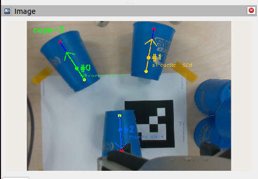

# fallen-cup-recovery

Doosan M0609 + RG2 그리퍼 + Intel RealSense 카메라로 **넘어진 컵을 인식하여 잡고 세우는** ROS 2 (Humble) 시스템.

YOLOv26-seg가 카메라 영상에서 `fallen-cup` / `upright-cup` 두 클래스를 분리해 segmentation하고,
`fallen-cup` mask에서만 yaw 방향벡터를 추출하여 그리퍼가 컵 머리 옆을 잡고 들어 올린 뒤 세웁니다.
<p align="center">
  
</p>

## Demo Video
[](https://www.youtube.com/watch?v=p8Zon8WmvEE)

## 구성

두 ROS 2 패키지가 한 쌍으로 동작합니다.

### `speed_stack_yolo_seg` (인식 측)
- `/camera/color/image_raw`, `/camera/aligned_depth_to_color/image_raw` 구독
- 학습 클래스: `fallen-cup`, `upright-cup`
- [학습 코드 참고](https://github.com/2026-yarr-robotics/vision-YOLO/tree/main/hand-eye-view)

- 출력 토픽
  - `/fallen_cup/pose2d` (`std_msgs/Float32MultiArray`) — top/bottom 픽셀, 방향벡터, yaw, grip 픽셀, conf, 폭
  - `/fallen_cup/grasp_pose` (`geometry_msgs/PoseStamped`, camera optical frame) — 3D grasp point
  - `/fallen_cup/debug_image` (`sensor_msgs/Image`) — 디버그 오버레이
- 방향벡터는 `target_class_name=fallen-cup` mask에서만 추출 (upright-cup mask는 자동 제외)

### `dsr_practice` (로봇 제어 측)
- `stand_fallen_cup` 노드: 위 토픽 구독 → MoveIt + RG2로 컵 머리 옆을 잡고 들어 올린 뒤
  - `mode:=drop` — 그 자리에서 컵 떨어뜨림
  - `mode:=place` — 손목 pitch 회전으로 세워서 작업공간 다른 위치에 내려놓음

## 외부 의존성 (별도 설치 필요)

본 리포지토리에 포함되지 않은 항목:

- ROS 2 Humble
- [Doosan Robotics 공식 패키지](https://github.com/doosan-robotics/doosan-robot2) — `dsr_bringup2`, `dsr_controller2`, `dsr_moveit2`, `dsr_msgs2`, `dsr_moveit_config_m0609` 등
- MoveIt 2 (`moveit_py` 포함)
- `realsense2_camera` (Intel RealSense ROS 2 wrapper)
- Python: `ultralytics`, `torch`, `opencv-python`, `pymodbus`, `numpy`

## 빌드

```bash
mkdir -p ~/ros2_ws/src
cd ~/ros2_ws/src

# 본 리포지토리
git clone https://github.com/2026-yarr-robotics/fallen-cup-recovery.git

# Doosan 공식 패키지 (같은 src/ 아래)
git clone https://github.com/doosan-robotics/doosan-robot2.git

cd ~/ros2_ws
colcon build --symlink-install
source install/setup.bash
```

## 실행

세 개의 터미널이 필요합니다.

**1) Doosan bringup + MoveIt**
```bash
ros2 launch dsr_bringup2 dsr_bringup2_moveit.launch.py
```

**2) RealSense + YOLO 인식 노드**
```bash
ros2 launch realsense2_camera rs_launch.py align_depth.enable:=true
ros2 launch speed_stack_yolo_seg fallen_cup_pose.launch.py \
    weights_path:=<path/to/best.pt> \
    use_depth:=true \
    imgsz:=1280 \
    conf:=0.70 \
    target_class_name:=fallen-cup
```

**3) 로봇 제어 노드**
```bash
ros2 launch dsr_practice stand_fallen_cup.launch.py mode:=drop
# 또는 mode:=place
```

## 주요 파라미터

`stand_fallen_cup`
- `mode` — `drop` | `place`
- `dry_run` — `true`면 approach까지만 가서 그리퍼 yaw 정렬 확인 (close/lift 없음)
- `cup_yaw_override_deg` — NaN이 아니면 인식 yaw 무시하고 강제 값 사용
- `sim` — HW 없이 MoveIt virtual에서 시뮬레이션

`fallen_cup_pose_node`
- `target_class_name` — 기본 `fallen-cup`. 빈 문자열이면 클래스 필터링 끔
- `mode` — `auto` | `silhouette` | `two_face`
- `use_depth` — true일 때만 3D grasp_pose publish

## 자산 및 캘리브레이션 참고사항

- **`dsr_practice/config/T_gripper2camera.npy`**
  본 저자 셋업의 핸드아이 캘리브 결과(4×4, 단위 mm). **참고용으로만 사용하세요.**
  카메라 마운팅과 RG2 장착 위치가 다르면 동작이 어긋나므로, **본인 로봇에서 재캘리브 강력 권장**합니다.
- **`speed_stack_yolo_seg/weights/best.pt`**
  `.gitignore`에 의해 repo에서 제외됨. YOLOv26-seg를 `fallen-cup` / `upright-cup` 두 클래스로 직접 학습한 뒤
  `weights_path` 런치 인자로 경로를 지정하세요.

## 라이선스

TODO
